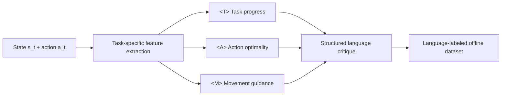

# LLF-Bench for Language-Critique Imitation Learning

[LCIL paper](https://arxiv.org/abs/2607.01225) · [LCIL code](https://github.com/CHYang25/LLM-BC) · [This fork](https://github.com/CHYang25/LLF-Bench) · [Microsoft LLF-Bench](https://github.com/microsoft/LLF-Bench)

> [!IMPORTANT]
> This repository is the research fork of LLF-Bench used by **Language-Critique Imitation Learning from Suboptimal Demonstrations**. It extends [Microsoft's original LLF-Bench](https://github.com/microsoft/LLF-Bench) and is included as the `LLF-Bench/` submodule of [LLM-BC](https://github.com/CHYang25/LLM-BC). For the original interactive-learning benchmark, documentation, and results, use the Microsoft repository and [original paper](https://arxiv.org/abs/2312.06853).

This fork provides the **environment and language-label layer** for the LC-BC and LC-DP experiments. It wraps continuous-control benchmarks behind a common Gymnasium API, generates task-specific natural-language critiques for state-action pairs, and exposes success, reward, and rendering signals for evaluation. Policy models, training workspaces, datasets, and paper experiment configs live in the parent [LLM-BC repository](https://github.com/CHYang25/LLM-BC).

## Role in LCIL

The fork serves three purposes:

1. **Environment benchmark.** It provides the navigation, gameplay, and manipulation environments used to collect demonstrations and evaluate policies.
2. **Structured language-label generator.** Task wrappers convert state-action behavior into natural-language descriptions of task progress, action quality, and corrective movement.
3. **Common evaluation interface.** Every wrapper exposes the same observation dictionary and keeps scalar reward available for metrics without treating it as language supervision.

The generator used in the paper can be summarized as:



The labels are usually emitted as fluent prose rather than with literal `<T>`, `<A>`, and `<M>` prefixes. These symbols name the three semantic components used in the paper:

- `<T>` identifies the current task stage or relevant subgoal;
- `<A>` describes whether the demonstrated action is beneficial, ineffective, or harmful;
- `<M>` gives task-relevant corrective motion or control guidance.

Task wrappers derive these components from the state/action quantities available to the environment adapter. Prompt pools and seeded template sampling add linguistic variation while retaining the same control-relevant semantics. The parent repository then distills these generated labels into its differentiable LLM-Captioner; this fork does not train the captioner or the policy.

## Paper environments

The LCIL paper evaluates the following eight state-based continuous-control tasks:

| Paper task | Benchmark | LLF-Bench environment ID | Install extra |
| --- | --- | --- | --- |
| Maze | D4RL PointMaze | `llf-pointmaze-maze2d-medium-v0` | base install; see [PointMaze note](#legacy-d4rl--pointmaze) |
| Parking | Highway-Env | `llf-highway-parking-v0` | `highway` |
| Sweep | MetaWorld | `llf-metaworld-sweep-v2` | `metaworld` |
| Box-close | MetaWorld | `llf-metaworld-box-close-v2` | `metaworld` |
| BlockPush | Block Pushing | `llf-blockpushing-BlockPushMultimodal-v0` | `blockpushing` |
| PegInsert | ManiSkill | `llf-maniskill-PegInsertionSide-v1` | `maniskill` |
| Hammer | Gymnasium-Robotics Adroit | `llf-adroit-adroit-hand-hammer-v1` | `adroit` |
| Relocate | Gymnasium-Robotics Adroit | `llf-adroit-adroit-hand-relocate-v1` | `adroit` |

The fork also retains the broader upstream benchmark and contains additional or experimental continuous-control adapters, including PushT, ManiSkill RollBall, Adroit Door, and other MetaWorld tasks. They are not part of the paper's main eight-task comparison.

## What this fork changes

Relative to the original Microsoft LLF-Bench, this branch focuses on language-labeled continuous control for offline imitation learning. The main changes include:

- task adapters for Block Pushing, ManiSkill, PushT, PointMaze, and Adroit;
- specialized feedback logic and prompt pools for the paper environments;
- task-specific scripted or learned oracles for action guidance and demonstration collection;
- state and optional image observations used by the parent LCIL pipelines;
- Gym-to-Gymnasium compatibility for legacy environments;
- environment and reset randomization used for distribution-shift experiments;
- multi-step critique mergers used by sequence/image captioning paths where configured;
- automatic retrieval of the PushT and Parking oracle checkpoints during editable installation;
- a deterministic MetaWorld seeding fix described below.

The original `all_feedback.jpg` and `partial_feedback.jpg` files report results from the upstream interactive LLF-Bench evaluation. They are retained for provenance but are **not** LC-BC or LC-DP results; current LCIL results are reported in the [LCIL paper](https://arxiv.org/abs/2607.01225) and [parent README](https://github.com/CHYang25/LLM-BC#main-results).

## Language-feedback API

The public entry point is `llfbench.make`, which follows the Gymnasium reset/step API:

```python
import llfbench

env_id = "llf-metaworld-box-close-v2"

env = llfbench.make(
    env_id,
    instruction_type="b",
    feedback_type=("hp", "hn", "fp"),
    visual=False,
    seed=42,
    warning=False,
)
env.action_space.seed(42)

observation, info = env.reset(seed=42)
action = env.action_space.sample()
next_observation, reward, terminated, truncated, info = env.step(action)

print(observation["instruction"])
print(next_observation["feedback"])
print("success:", info["success"])

env.close()
```

For deterministic rollouts, pass the seed both when constructing the environment and when calling `reset`.

Each returned observation is a dictionary with three fields:

| Field | Meaning |
| --- | --- |
| `observation` | Textualized state, or `{text, image}` when visual observations are enabled |
| `instruction` | Natural-language task and action-space description, normally supplied at reset |
| `feedback` | Selected language-feedback components verbalized as one string |

Some continuous-control wrappers provide initial future guidance at reset so that the data collector can obtain its first oracle action. Missing components are represented as `None`.

The scalar `reward` returned by `step` is intended for evaluation and success accounting. In the LLF interface it should not be exposed to a learning agent as ordinary reward supervision. LCIL policies are trained from offline actions and structured language labels, and do not require LLF text or an oracle at deployment time.

### Instruction and feedback types

Support is task-dependent. Query an environment before configuring it:

```python
instruction_types, feedback_types = llfbench.supported_types(env_id)
print(instruction_types, feedback_types)
```

The current continuous-control wrappers generally support basic instruction type `b`. The common feedback vocabulary is:

| Type | Meaning |
| --- | --- |
| `r` | textualized scalar reward |
| `hp` | hindsight-positive explanation for a desirable action |
| `hn` | hindsight-negative explanation for a suboptimal action |
| `fp` | future-positive suggestion or oracle guidance |
| `fn` | future-negative suggestion, when implemented by the task |
| `n` | no feedback |
| `a` | all feedback types supported by that environment |
| `m` | one randomly selected supported feedback type per transition |

An explicit string or iterable may be passed as `feedback_type`. The LCIL data pipeline uses `("hp", "hn", "fp")` for the paper environments.

## How language labels are produced

The implementation is split into a common interface and task-specific logic:

| Location | Responsibility |
| --- | --- |
| [`llfbench/envs/llf_env.py`](llfbench/envs/llf_env.py) | `Feedback` schema, feedback selection, seeded paraphrasing, and final verbalization |
| `llfbench/envs/<family>/wrapper.py` | task-stage inference, action assessment, motion guidance, success logic, and observation formatting |
| `llfbench/envs/<family>/task_prompts/` | task-progress and task-specific critique templates |
| `llfbench/envs/<family>/utils_prompts/` | conjunction, direction, degree, and recommendation variations |
| `llfbench/envs/<family>/oracles/` | learned or scripted action guidance where a task requires it |
| [`llfbench/envs/highway/multistep_merger/`](llfbench/envs/highway/multistep_merger/) | structured reduction of several step-level critiques for multi-step captioning |

At each step, a task wrapper:

1. formats the current state for the shared observation interface;
2. determines the current task stage and relevant subgoal;
3. compares the behavior with task-specific progress or oracle criteria;
4. selects the requested `Feedback` fields;
5. samples semantically equivalent templates and concatenates the non-empty fields.

During dataset generation, the parent [`scripts/gen_dataset.py`](https://github.com/CHYang25/LLM-BC/blob/main/scripts/gen_dataset.py) reads the oracle action from future guidance to collect a trajectory. It stores the remaining task-progress, action-quality, and movement-guidance prose as the training label, removing the final raw expert-action recommendation. No LLM API call is required for these rule/template-generated labels.

## Installation

### Recommended: install through LLM-BC

For paper reproduction, use the parent repository's [`environment.yaml`](https://github.com/CHYang25/LLM-BC/blob/main/environment.yaml), which is the authoritative dependency specification. The current setup targets Linux, Python 3.9, and an NVIDIA GPU for training:

```bash
git clone --recursive https://github.com/CHYang25/LLM-BC.git
cd LLM-BC

conda env create -f environment.yaml
conda activate llm-bc

pip install -e .
pip install -e "./LLF-Bench[metaworld,blockpushing,maniskill,pusht,highway,adroit]"
bash LLF-Bench/blockpushing_install.sh
```

For an existing parent-repository clone, initialize the fork with:

```bash
git submodule update --init --recursive
```

This environment intentionally contains both legacy Gym and Gymnasium because PointMaze and Block Pushing still depend on older APIs. Important current versions include Python 3.9, Gym 0.23.1, Gymnasium 0.29.1, MuJoCo 2.3.7, ManiSkill 3.0.0b20, and the MetaWorld commit pinned in `setup.py`.

### Standalone environment development

For working only on this fork:

```bash
git clone https://github.com/CHYang25/LLF-Bench.git
cd LLF-Bench

conda create -n llfbench-lcil python=3.9 -y
conda activate llfbench-lcil

pip install -e ".[metaworld,blockpushing,maniskill,pusht,highway,adroit]"
bash blockpushing_install.sh
```

Available extras are defined in [`setup.py`](setup.py): `metaworld`, `alfworld`, `maniskill`, `blockpushing`, `pusht`, `highway`, and `adroit`. Install only the task families you need when a smaller environment is preferable.

The editable install is configured to download the learned PushT and Parking oracle checkpoints from the `LLM-BC` Hugging Face organization. To intentionally skip this step:

```bash
LLFBENCH_SKIP_CHECKPOINTS=1 pip install -e ".[highway,pusht]"
```

Skipping those checkpoints is suitable for development that does not request the corresponding oracle guidance; fetch them before collecting PushT or Parking demonstrations.

### Headless rendering

The parent setup uses OSMesa as the portable headless default:

```bash
conda env config vars set MUJOCO_GL=osmesa
conda env config vars set PYOPENGL_PLATFORM=osmesa
conda env config vars set TF_USE_LEGACY_KERAS=false
conda env config vars set D4RL_SUPPRESS_IMPORT_ERROR=1
conda deactivate
conda activate llm-bc
```

GPU-backed offscreen rendering may use `MUJOCO_GL=egl` when supported by the host driver. Do not set `DISPLAY=:0` unless an X server is actually running there.

### Legacy D4RL / PointMaze

The Maze adapter imports `mujoco-py` through D4RL and may also require a local MuJoCo 2.1 installation even though the rest of the environment uses the modern `mujoco` 2.3.7 package. Follow the [PointMaze setup in the parent README](https://github.com/CHYang25/LLM-BC#legacy-d4rl--pointmaze-setup) if `mujoco-py` cannot locate MuJoCo or OpenGL.

## Dataset generation and evaluation

Released datasets are recommended for exact paper reproduction. To generate new expert trajectories and rule/template-based critiques from the parent repository root:

```bash
python scripts/gen_dataset.py \
    --env-id metaworld-box-close-v2 \
    --num-episodes 500 \
    --max-steps 30 \
    --parallel
```

The `--env-id` argument omits the leading `llf-`; the script adds it before calling `llfbench.make`. Related parent-repository tools collect suboptimal-policy rollouts, merge expert and suboptimal buffers, produce scalar/categorical ablations, and generate VLM labels. See [Regenerating datasets](https://github.com/CHYang25/LLM-BC#regenerating-datasets) for the full workflow.

At evaluation time, the parent environment runners use this fork for transitions, success metrics, and optional video rendering. LC-BC and LC-DP policies consume the configured state or image observation; the language-label generator and LLM-Captioner are training-time components and add no policy inference cost.

## Reproducibility bug fix

The upstream MetaWorld adapter did not pass its seed into the MetaWorld benchmark constructor, so reconstructing and resetting an environment with the same seed could select different tasks. This fork fixes that behavior in [`llfbench/envs/metaworld/__init__.py`](llfbench/envs/metaworld/__init__.py) by:

- constructing `metaworld.MT1` with the requested seed;
- seeding Python and NumPy when resetting;
- selecting from the seeded benchmark task list; and
- forwarding the reset seed to the underlying environment.

Use the same seed at construction and reset, as shown in the API example. Task-specific seeding has also been added to several new adapters, but the legacy upstream environment families have not all been audited for bitwise reproducibility.

## Testing

[`tests/test_envs.py`](tests/test_envs.py) checks the LLF observation contract, action and observation spaces, termination fields, and equivalence of two rollouts created with the same seed. Run a targeted environment prefix after installing its dependencies:

```bash
python tests/test_envs.py llf-metaworld-box-close-v2
python tests/test_envs.py llf-highway-parking-v0
```

Additional task-specific smoke scripts are available for [Block Pushing](tests/block_pushing_test.py) and [ManiSkill](tests/mani_skill_test.py). Simulator tests can require oracle checkpoints, rendering libraries, and a suitable CPU/GPU backend.

## Citation and attribution

If this fork contributes to an LCIL experiment, please cite both the LCIL paper and the original LLF-Bench paper:

```bibtex
@article{yang2026languagecritique,
  title   = {Language-Critique Imitation Learning from Suboptimal Demonstrations},
  author  = {Yang, Chih-Han and Wu, Dai-Jie and Huang, Yun-Ping and Hsieh, Ping-Chun and Marino, Kenneth and Sun, Shao-Hua},
  journal = {arXiv preprint arXiv:2607.01225},
  year    = {2026}
}

@article{cheng2023llfbench,
  title   = {{LLF-Bench}: Benchmark for Interactive Learning from Language Feedback},
  author  = {Cheng, Ching-An and Kolobov, Andrey and Misra, Dipendra and Nie, Allen and Swaminathan, Adith},
  journal = {arXiv preprint arXiv:2312.06853},
  year    = {2023}
}
```

This project is derived from [microsoft/LLF-Bench](https://github.com/microsoft/LLF-Bench). The Adroit integration also borrows code from [aravindr93/hand_dapg](https://github.com/aravindr93/hand_dapg). Please cite the underlying environment projects used by your experiments as appropriate.

The fork retains the upstream [MIT License](LICENSE). Microsoft does not provide support for the modifications in this research fork; fork-specific issues should be reported to the [CHYang25/LLF-Bench issue tracker](https://github.com/CHYang25/LLF-Bench/issues) or the parent [LLM-BC repository](https://github.com/CHYang25/LLM-BC/issues).
